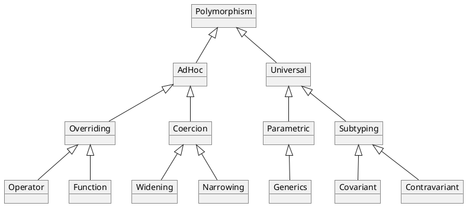
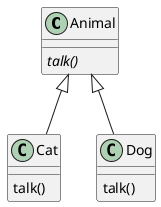

# Polymorphism
> Polymorphism is about providing a single interface for multiple types.
## Static vs dynamic
**Static dispatch**: fastest, polymorphism resolved at compile time.

**Dynamic dispatch**: slowest, polymorphism resolved at run time.
## Types

<!-- tabs:start -->
#### ** Ad-Hoc **
#### Overriding
TODO
#### Coercion
TODO
#### ** Universal **
#### Subtyping (or inclusion)

```java
abstract class Animal {
    abstract String talk();
}

class Cat extends Animal {
    String talk() {
        return "Meow!";
    }
}

class Dog extends Animal {
    String talk() {
        return "Woof!";
    }
}

static void letsHear(final Animal a) {
    println(a.talk());
}

static void main(String[] args) {
    letsHear(new Cat());
    letsHear(new Dog());
}
```
```
Meow!
Woof!
```
#### Parametric
Parametric is about instancing a generic type with actual type arguments.
```java
interface Collection<E>  { 
  public void add(E x);
  public Iterator<E> iterator();
}

static void main(String[] args) {
  Collection<Animal> collection = new LinkedList<Animal>();
}
```
<!-- tabs:end -->
## Duck typing
TODO
## Sources
> https://stackoverflow.com/tags/polymorphism/info
>
> https://en.wikipedia.org/wiki/Polymorphism_(computer_science)
>
> https://www.angelikalanger.com/GenericsFAQ/JavaGenericsFAQ.html
>
> https://javapapers.com/core-java/java-polymorphism/