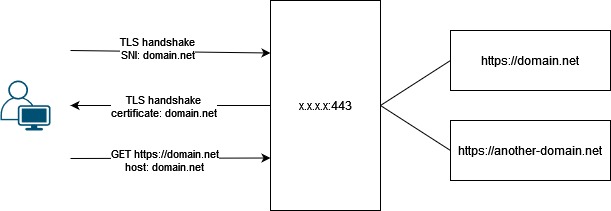

# SSL cheat sheet

```
man openssl-s_client
man openssl-req
man openssl-x509
```

## Compare a key, csr and certificate public parts

```bash
openssl pkey -in private.key -pubout -outform pem | sha256sum
openssl x509 -in certificate.crt -pubkey -noout -outform pem | sha256sum
openssl req -in request.csr -pubkey -noout -outform pem | sha256sum
```

## Generate a CSR & private key in one shot

```bash
openssl req -nodes -new -config <(
cat <<-EOF
[ req ]
distinguished_name = req_distinguished_name
prompt = no
[ req_distinguished_name ]
CN = domain.net
EOF
)
```

```bash
openssl req -nodes -new -config <(
cat <<-EOF
[ req ]
req_extensions = req_ext
distinguished_name = req_distinguished_name
prompt = no
[ req_distinguished_name ]
CN = domain.net
[ req_ext ]
subjectAltName = @alt_names
[ alt_names ]
DNS.1 = *.domain.net
DNS.2 = *.sub.domain.net
EOF
)
```

## Print a chain from an URL

```bash
# servername required if SNI
echo | openssl s_client -showcerts -servername www.domain.net -connect domain.net:443
```

## CAA

DNS record to restrict the certificate authorities allowed to issue certificates on their domain name.

```bash
# example from google.com
$ dig CAA google.com
[...]
;; ANSWER SECTION:
google.com.             86400   IN      CAA     0 issue "pki.goog"
[...]
```

## SNI [Server Name Indication]

Multi-domain handshake support.



## ESNI [Encrypted Server Name Indication]

Partial encrypted version of SNI, deprecated and replaced by ECH.

## ECH [Encrypted Client Hello]

Total encrypted version of SNI.

> https://blog.cloudflare.com/encrypted-client-hello/

## CT [Certificate transparency]

Logs and monitoring of certificate issuances. (e.g. https://crt.sh/)

> https://certificate.transparency.dev/

## CRL [Certificate Revocation List]

Certificate revocation status list (https://letsencrypt.org/2022/09/07/new-life-for-crls/).

## OCSP [Online Certificate Status Protocol]

Certificate revocation status list hosted by the CA (e.g. https://letsencrypt.org/docs/lencr.org/).
Deprecated in favor of CRLs (https://letsencrypt.org/2024/07/23/replacing-ocsp-with-crls/).

## SCT [Signed Certificate Timestamps]

TLS extension, timestamps requested by the CA, provided by the CT server logs as a promise to add the certificate once it is issued. The timestamps signatures must be added to the certificate before the MMD [Maximum Merge Delay].

```bash
# Example from the `*.google.com`:
CT Precertificate SCTs:
  Signed Certificate Timestamp:
      Version   : v1 (0x0)
      Log ID    : 51:A3:B0:F5:FD:01:79:9C:56:6D:B8:37:78:8F:0C:A4:
                  7A:CC:1B:27:CB:F7:9E:88:42:9A:0D:FE:D4:8B:05:E5
      Timestamp : Sep 12 09:17:05.861 2022 GMT
      Extensions: none
      Signature : ecdsa-with-SHA256
                  30:45:02:20:44:24:D8:45:00:5F:73:39:FF:3D:50:DB:
                  C2:62:BA:ED:8E:3E:85:2C:28:1B:A0:6F:EF:BF:05:FB:
                  EF:C3:26:6A:02:21:00:AE:2D:F6:27:29:C6:39:9D:E6:
                  7A:18:AD:FB:2A:6E:16:CA:92:00:BF:E5:4B:55:49:28:
                  DE:EF:04:E1:D5:F5:85
  Signed Certificate Timestamp:
      Version   : v1 (0x0)
      Log ID    : 46:A5:55:EB:75:FA:91:20:30:B5:A2:89:69:F4:F3:7D:
                  11:2C:41:74:BE:FD:49:B8:85:AB:F2:FC:70:FE:6D:47
      Timestamp : Sep 12 09:17:05.880 2022 GMT
      Extensions: none
      Signature : ecdsa-with-SHA256
                  30:45:02:21:00:8A:79:E6:59:A8:A3:1B:2F:43:34:75:
                  A0:5B:86:2B:10:96:DB:40:A3:7B:05:E0:52:74:C0:CB:
                  56:3C:25:A0:D8:02:20:23:B7:1F:AB:A5:C8:DC:65:AB:
                  C5:1C:BA:03:69:CC:1B:0E:0C:63:03:E2:89:E5:01:AF:
                  16:8B:6C:E4:C0:EC:9F
```

## PSL [Public suffix list]

https://publicsuffix.org/

https://publicsuffix.org/list/public_suffix_list.dat

A community-managed list of TLDs and domains on which the certificate issuance is usually prevented. (originally used to several browser needs like avoid supercookies etc...).

> Sources:
>
> - https://www.cloudflare.com/learning/ssl/what-is-ssl/
> - https://letsencrypt.org/docs/
> - https://www.digicert.com/faq/certificate-transparency/enabling-ct.htm
> - https://letsencrypt.org/docs/challenge-types/
> - https://sectigo.com/knowledge-base/detail/Domain-Control-Validation-DCV-Methods/kA01N000000brbt
